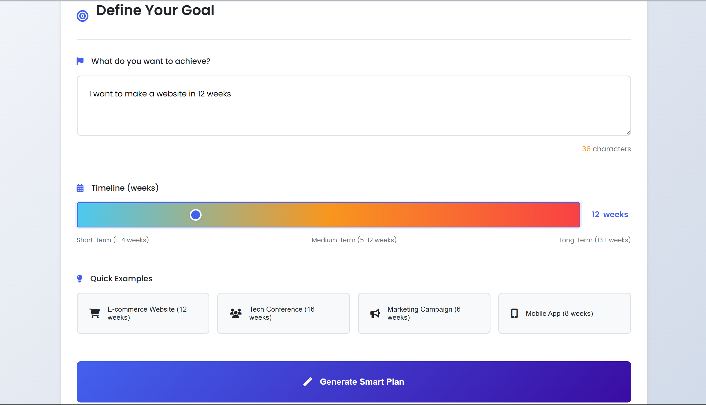
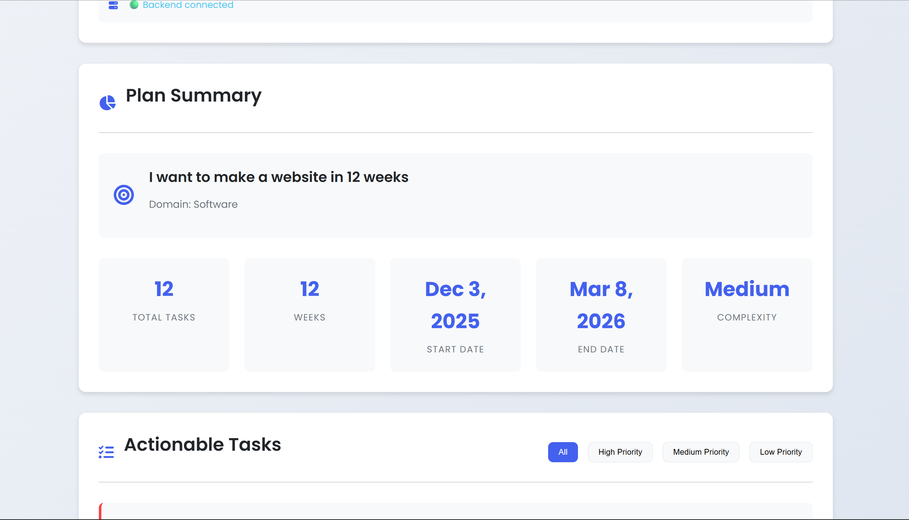
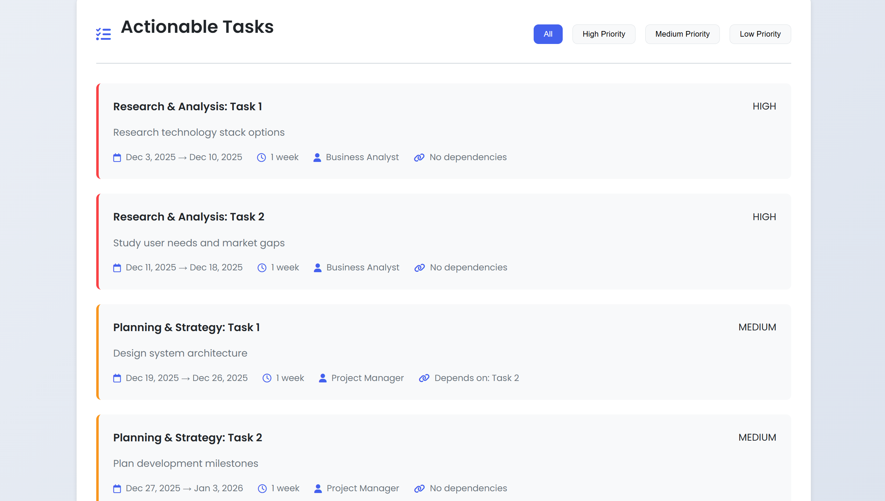
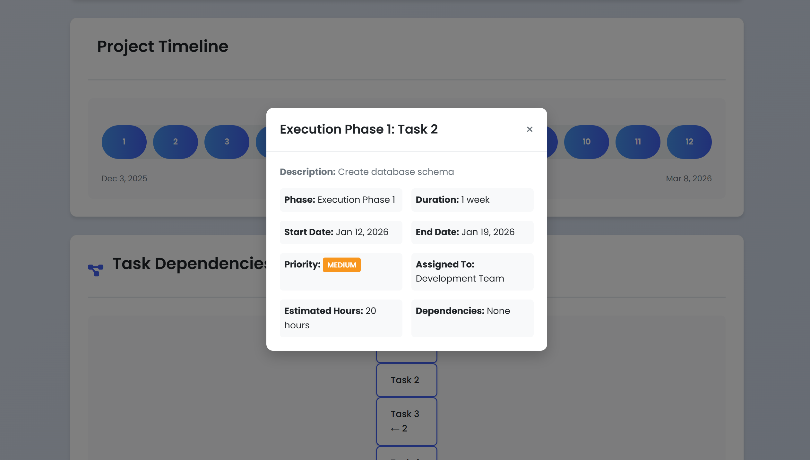
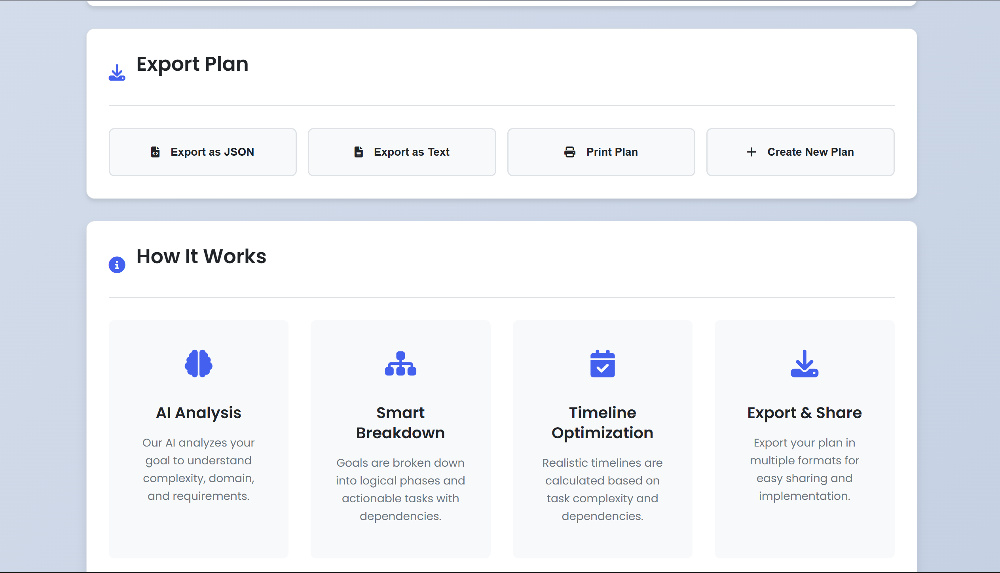

**Smart Task Planner**

A small demo project that uses a lightweight AI-style planner in the backend (Flask) to break down user goals into actionable tasks, timelines, dependencies and a frontend to interact with the service.

**Table of Contents**
- **Project Overview**: Quick description and features
- **How It Works**: Architecture and algorithmic flow
- **Getting Started**: Run the backend and frontend locally (PowerShell examples)
- **API Endpoints**: Useful endpoints and example requests
- **Project Screenshots**: Placeholders for screenshots you can add
- **Troubleshooting**: Common issues and fixes
- **Contributing**: How to contribute
- **License**

**Project Overview**
- **Purpose**: Convert high-level goals into a task plan with phases, start/end dates, dependencies and priorities.
- **Tech stack**: **Backend**: `Flask` (Python). **Frontend**: Plain HTML/CSS/JS. Small in-memory store for demo purposes.
- **Key features**: Domain detection (software/marketing/event), task breakdown, dependency generation, simple critical-path estimation, export controls in the UI.

**How It Works**
- **High level**: The frontend collects a goal description and a timeline (weeks) then requests the backend `/api/plan` endpoint. The backend's `SmartTaskPlanner` class analyzes the goal and emits a plan object with tasks and metadata.
- **Backend flow**:
  - `detect_domain(goal_text)` — guess project domain from keywords.
  - `break_down_goal(goal_text, timeline_weeks)` — main planner: picks phases, generates tasks per phase, estimates durations, assigns start/end dates, dependencies and priorities.
  - `generate_dependencies(task_index, total_tasks)` — a heuristic that links most tasks to previous ones and occasionally to earlier tasks.
  - `calculate_critical_path(tasks)` — a simple heuristic to identify a likely critical path.
  - Plans are stored in a simple in-memory dict (`task_plans`) and exposed via REST endpoints for retrieval.

**Project Structure (important files)**
- `backend/app.py` — Flask API and planning logic (main server file).
- `backend/requirements.txt` — Python dependencies for the backend.
- `frontend/index.html` — Single-page frontend UI.
- `frontend/style.css` and `frontend/script.js` — UI styles and client logic.

**Getting Started (Run locally)**
These commands use Windows PowerShell syntax. Adjust if you prefer another shell.

1) Prepare Python environment (recommended)

```powershell
python -m venv .venv
.\\.venv\\Scripts\\Activate.ps1
pip install -r backend/requirements.txt
```

2) Run the backend API

```powershell
$env:PORT = '5000'
python backend/app.py

python backend/app.py
```

The server listens on `http://localhost:5000` by default and prints helpful links (root docs, health check, sample plan).

3) Serve the frontend

Option A — open directly (quick demo):

```powershell
start ./frontend/index.html
```

Option B — run a local static server (recommended for fetch/XHR to backend when using CORS):

```powershell
cd frontend
python -m http.server 8000
```

Notes:
- The backend enables CORS so the frontend served from a different port should be able to reach it.
- If you change the backend port, update the JavaScript `fetch` URL in `frontend/script.js` accordingly.

**API Endpoints & Examples**
- `GET /` — API info
- `POST /api/plan` — Generate plan
- `GET /api/plans` — List saved plans
- `GET /api/plans/<id>` — Get a single plan
- `GET /api/sample` — Get a sample generated plan
- `GET /health` — Health check

Example `curl` (bash)

```bash
curl -X POST http://localhost:5000/api/plan \\
  -H "Content-Type: application/json" \\
  -d '{"goal": "Launch a mobile app for fitness tracking", "timeline": 8}'
```

Example PowerShell (Invoke-RestMethod)

```powershell
Invoke-RestMethod -Method Post -Uri http://localhost:5000/api/plan -ContentType 'application/json' -Body (@{goal='Launch a mobile app for fitness tracking'; timeline=8} | ConvertTo-Json)
```

**Project Screenshots**

### Homepage


### Goal Input


### Generating Task


### Timeline Visualization


### Export Options



You can display images inline in this README by using the relative paths, for example:

```

```

If you'd prefer a separate `docs/screenshots/` folder, copy or move images there and update the paths above.

**Troubleshooting**
- If the backend fails to start: ensure dependencies are installed and Python version is 3.8+.
- If the frontend cannot reach the backend: check the console for CORS or network errors and ensure the backend is running and the ports match.
- If PowerShell blocks script execution when activating the venv: run `Set-ExecutionPolicy -Scope CurrentUser -ExecutionPolicy RemoteSigned` (requires admin rights or confirm prompt). Revert policy after if desired.


If you'd like, I can:
- add a small `docs/` README rendering with actual screenshots after you provide them,
- or patch `frontend/script.js` to include the API base URL in a central constant.


